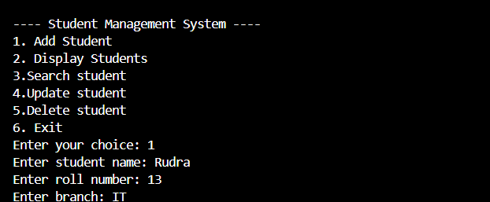

# Student Management System

A Student Management System developed using Python that allows users to manage student records efficiently through both Command Line Interface (CLI) and Graphical User Interface (GUI).

## Features

** CLI Version
- Add student details
- Display all student records
- Search student information
- Update student data
- Delete student records
- File handling for data storage

** GUI Version
- User-friendly graphical interface using Tkinter
- Add and manage student records through buttons and input fields
- Display student data in a list view
- Search, update, and delete functionality
- Data stored permanently using text files

## Technologies Used
- Python
- Tkinter
- File Handling
- Git
- GitHub
- Visual Studio Code

## Project Structure
main.py        -> CLI Version
gui_main.py    -> GUI Version
students.txt   -> Data Storage File

## Project Screenshots

## Project Status
Currently under development and continuously being improved as part of my Computer Science learning journey.

## Future Improvements
- Add database support
- Improve GUI design
- Add login/authentication system
- Export student reports

## Author
Bhoomika Narkhede
